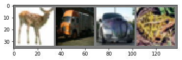

# Working With The CIFAR10 Dataset

This is it. You've seen how to define a simple convolutional neural network, compute loss w.r.t. the graph Variables, and make gradient updates manually and with `torch.nn.optim` package. Now you might be thinking:

### What about the data?

Generally, when you have to deal with image, text, audio or video data, you can use standard python packages that load data into a numpy array. Then you can convert this array into a `torch.*Tensor`.

- For images, packages such as `Pillow`, `OpenCV` are useful.
- For audio, packages such as `scipy` and `librosa`.
- For text, either raw Python or Cython based loading, or `NLTK` and `SpaCy` are useful.

Specifically for [Computer vision](https://en.wikipedia.org/wiki/Computer_vision), the creators of pytorch have generously created a package called `torchvision`, that has data loaders for common [datasets](http://pytorch.org/docs/master/torchvision/datasets.html) such as [Imagenet](http://www.image-net.org), [CIFAR10](https://www.cs.toronto.edu/~kriz/cifar.html), [MNIST](http:///yann.lecun.com/exdb/mnist/), etc. and data transformers for images, viz., `torchvision.datasets` and `torch.utils.data.DataLoader`. This provides a huge convinence from writing boiler plate code.

We will use the **CIFAR10 dataset**. It has the classes: *‘airplane’, ‘automobile’, ‘bird’, ‘cat’, ‘deer’, ‘dog’, ‘frog’, ‘horse’, ‘ship’, ‘truck’*. The images in CIFAR-10 are of size `3x32x32`, i.e. 3-channel color images of `32x32` pixels in size.


### Training an image classifier

We will do the following steps in order:

1. Load and normalizing the CIFAR10 training and test datasets using `torchvision`.
2. Define a Convolution Neural Network.
3. Define a loss function.
4. Train the network on the training data.
5. Test the network on the test data.

#### 1. Loading and normalizing CIFAR10

Using `torchvision`, it’s extremely easy to load CIFAR10.

In [1]:

```python
%matplotlib inline

# file manipulation
import os

# arrays and visualization
import numpy as np
import matplotlib.pyplot as plt

# pytorch imports
import torch
import torch.nn as nn
import torch.optim as optim
import torch.nn.functional as F
from torch.autograd import Variable

# Special package provided by pytorch
import torchvision
import torchvision.transforms as transforms
```

Define the data directory, i.e. where the data should be downloaded to. With the use of `os.path` module.

**NOTE:** `data_dir` could be modified to fit your use.

In [2]:

```python
data_dir = os.path.join('../datasets', os.path.basename(os.getcwd()))

if not os.path.isdir(data_dir):
    os.makedirs(data_dir)
    print(f'Created {os.path.basename(data_dir)} directory @ {data_dir}')
else:
    print(f'data_dir = {data_dir}')
```

```sh
data_dir = ../datasets/04 - Training a classifier

```

The output of the `torchvision` dataset are PILImage images of range [0, 1]. We transform them to Tensors of normalized range [-1, 1].

In [3]:

```python
# Transform rule
transform = transforms.Compose([transforms.ToTensor(), 
                                transforms.Normalize((0.5, 0.5, 0.5), 
                                                     (0.5, 0.5, 0.5))])

# maybe download
download = not os.path.exists(os.path.join(data_dir, 'cifar-10-batches-py'))

# Download the dataset
trainset = torchvision.datasets.CIFAR10(root=data_dir, train=True, 
                                        download=download, transform=transform)
testset = torchvision.datasets.CIFAR10(root=data_dir, train=False, 
                                       download=download, transform=transform)

# loaders
trainset = torch.utils.data.DataLoader(trainset, batch_size=4, shuffle=True, num_workers=2)
testset = torch.utils.data.DataLoader(testset, batch_size=4, shuffle=False, num_workers=2)

# class labels
classes = ('plane', 'car', 'bird', 'cat', 'deer', 'dog', 'frog', 'horse', 'ship', 'truck')
```

In [4]:

```python
# Let's visualize the data

def imshow(img):
    img = img / 2 + 0.5  # unnormalize
    np_img = img.numpy()
    plt.imshow(np.transpose(np_img, (1, 2, 0)))

# Get random training images
train_iter = iter(trainset)
images, labels = train_iter.next()

# show images
imshow(torchvision.utils.make_grid(images))

# print labels
print(' '.join(classes[ labels[i] ] for i in range(4)))
```



```sh
deer truck car frog

```

### 2. Define a Convolution Neural Network

It's time to define our neural network. You've already seen how to define a simple convolutional neural network in the last section. But this time, instead of a single color channel, we have 3-color channels, because the [CIFAR10 dataset](https://www.cs.toronto.edu/~kriz/cifar.html) contains colored images.

In [5]:

```python
class Network(nn.Module):
    
    def __init__(self, **kwargs):
        super(Network, self).__init__()
        
        # Hyper-parameters
        self._img_channels = kwargs.get('img_channels', 3)
        self._num_classes = kwargs.get('num_classes', 10)
        
        # 2 convolutional & 3 fully connected layers
        self.conv1 = nn.Conv2d(self._img_channels, 6, 1)
        self.conv2 = nn.Conv2d(6, 16, 1)
        flatten_size = self.conv2.out_channels * 8 * 8
        self.fc1 = nn.Linear(flatten_size, 120)
        self.fc2 = nn.Linear(120, 84)
        self.fc3 = nn.Linear(84, self._num_classes)
    
    def forward(self, x):
        # Convolutional layers
        x = F.relu(F.max_pool2d(self.conv1(x), 2))
        x = F.relu(F.max_pool2d(self.conv2(x), 2))
        # Flatten layer
        x = x.view(-1, self._flatten(x))
        # Fully connected layers
        x = F.relu(self.fc1(x))     # relu + linear
        x = F.dropout(x, p=0.5)     # 50% dropout
        x = F.relu(self.fc2(x))     # relu + linear
        x = F.sigmoid(self.fc3(x))  # sigmoid + linear
        return x
    
    def _flatten(self, x):
        size = x.size()[1:]  # input shape excluding batch dim.
        return torch.Tensor(size).numel()    
```

In [6]:

```python
# Instantiate the network and pass in our parameters
net = Network(img_channels=3, num_classes=len(classes))
```

